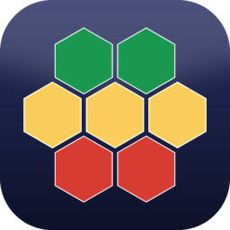
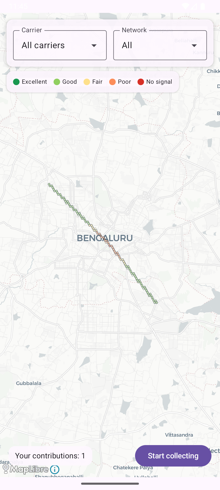

<div align="center">



# netatlas

**Crowdsourced cellular coverage atlas** — map real mobile signal strength (RSRP/dBm)
from users' phones and render it as a live heatmap, blended with open data where the
crowd hasn't reached yet.

[Download the app](../../releases/latest) · [Live backend](https://netatlas-backend-872879151769.asia-south1.run.app/carriers) · [Design doc](docs/plans/2026-06-13-netatlas-design.md) · [Deploy guide](docs/DEPLOY.md)

</div>

<div align="center">

</div>

---

## What it does

Phones passively measure the cellular signal they're already receiving. netatlas collects
those readings (signal strength + location + carrier + network type + phone model),
aggregates them per **H3 hexagon**, and shows a coverage heatmap — green where it's strong,
red where it's weak. The more people contribute, the better the map gets (the
*Where is my Train* model: data from users, for users).

- 📡 **Collect** — a background Android service reads live RSRP/dBm via `TelephonyManager`, pairs it with GPS, queues offline, and uploads opportunistically.
- 🧮 **Aggregate** — the backend buckets readings into H3 cells per `carrier × network × area`, computing mean/median/stddev, a **confidence score** (Welford online stats), and a coverage class.
- 🗺️ **Visualize** — a Compose Multiplatform map renders the hexes over a real street basemap, with **carrier / network filters** and tap-for-detail.

## Why Android-first (the one hard constraint)

> **iOS has no public API for cellular signal strength.** `CoreTelephony` exposes carrier
> and radio type but not dBm; the private routines are sandbox-blocked and any workaround is
> grounds for App Store rejection. So **collection is Android-only** — the same reason every
> app in this space (OpenSignal, TowerCollector, CellMapper) is Android-centric. The
> cross-platform viewer can still run on iOS/web; iOS just can't contribute signal readings.

See the [design doc](docs/plans/2026-06-13-netatlas-design.md) for the full feasibility analysis.

## Architecture

```
Android phone                         Cloud Run (Ktor)                  Any viewer
─────────────                         ───────────────                   ──────────
TelephonyCallback ─┐                                                     
Fused/LocationMgr ─┼─► reading ─POST─► validate + anomaly-filter ─► signal_readings (PostGIS)
phone make/model ──┘   (offline                                    │
                        queue,         aggregate per H3 hex ───────┴─► hex_aggregates
                        WorkManager)   (mean / confidence / class)     │
                                                                       └─GET /hexes(.geojson)─► MapLibre heatmap
                                       Postgres + PostGIS + H3              + carrier/network filters
```

**Tech:** Kotlin Multiplatform · Compose Multiplatform · MapLibre (CARTO basemap) ·
Ktor · Postgres + PostGIS · [Uber H3](https://h3geo.org) · Room + WorkManager ·
Testcontainers · deployed on **Google Cloud Run** + **Supabase**.

### Repo layout

```
netatlas/
├── shared/        # KMP: models, anomaly filter, aggregation math, API client, map view-model, H3 server helper
├── composeApp/    # Compose Multiplatform app — heatmap viewer + (androidMain) the native collector
├── backend/       # Ktor service: ingest → aggregate → serve; Dockerfile + deploy.sh
│   └── db/migrations/   # PostGIS schema (applied on boot)
├── iosApp/        # iOS host (viewer target — Phase 2)
└── docs/          # design, plan, DEPLOY.md
```

## Get the app

Grab the latest signed APK from [**Releases**](../../releases/latest) and install it
(enable "install from unknown sources"). It points at the live backend by default, so
you'll see the seeded Bengaluru heatmap immediately. Tap **Start collecting** (grant
location + phone permissions) and walk around to add your own readings.

> Running your own backend? Tap the **gear** in the filter bar and set the Server URL
> (e.g. `http://10.0.2.2:8080` for an emulator, or your machine's LAN IP for a device).

## Develop

**Backend (local):**
```bash
docker compose up -d --wait          # Postgres + PostGIS
./gradlew :backend:run               # Ktor on :8080  (reads JDBC_URL/DB_USER/DB_PASSWORD/PORT)
./gradlew :backend:seed              # optional: ~500 synthetic Bengaluru readings
curl "localhost:8080/hexes?minLng=77.4&minLat=12.8&maxLng=77.7&maxLat=13.1"
```
> macOS note: Homebrew `postgresql` on `:5432` shadows the container — map it to `5433`
> and pass `JDBC_URL=jdbc:postgresql://127.0.0.1:5433/netatlas` (see `backend/README.md`).

**Android app:**
```bash
./gradlew :composeApp:installDebug   # builds + installs on a running emulator/device
```

**Tests:**
```bash
./gradlew :shared:jvmTest            # models, anomaly filter, aggregation, API client, view-model
./gradlew :backend:test              # ingest/aggregate + routes (Testcontainers — needs Docker)
./gradlew :composeApp:connectedDebugAndroidTest   # Room + uploader (needs a device/emulator)
```

## Deploy

The backend is containerized for **Cloud Run** + a managed **Postgres/PostGIS** (Supabase).
One command:
```bash
GCP_PROJECT=<project> JDBC_URL=<...> DB_USER=<...> DB_PASSWORD=<...> backend/deploy.sh
```
Full walkthrough (Supabase setup, Cloud SQL alternative, pointing the app at the service):
[**docs/DEPLOY.md**](docs/DEPLOY.md).

## Roadmap

- [x] **M1** — Backend: ingest → H3 aggregation → API (Ktor + PostGIS)
- [x] **M2** — Android collector: telephony + location → offline queue → upload
- [x] **M3** — Heatmap viewer: MapLibre + carrier/network filters + hex detail
- [x] Deployed (Cloud Run + Supabase), signed release APK, app icon
- [ ] **M4** — Blend with OpenCelliD/BeaconDB open tower data (modeled fallback where crowd data is absent)
- [ ] **M5** — Phone-model breakdowns; iOS + web viewer targets (viewer-only)

## Status

Proof-of-concept. The full collect → aggregate → visualize loop works and is deployed.
Real signal collection requires a physical Android phone with a SIM (emulators report
synthetic telephony). Not production-hardened — no auth/rate-limiting yet (see roadmap).
